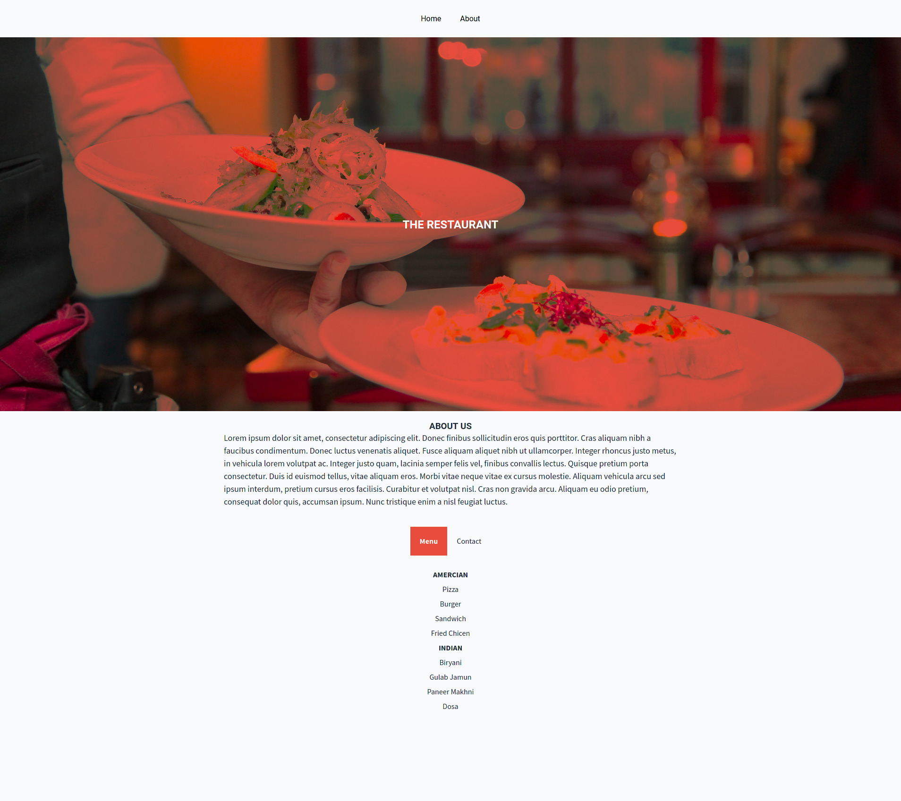

<h1 align="center">
  
</h1>

<h1 align="center">The Restaurant</h1>
      
<p align="center">
  <a href="#about">About</a> •
  <a href="#getting-started">Getting Started</a> •
  <a href="#contributing">Contributing</a> •
  <a href="#authors">Authors</a>
</p>

---

## About
This project contains a simple yet dynamic homepage for a restaurant. The goal of this project was to create the entire HTML content using DOM manipulation in Javascript


## Live Demo
[Live Demo](https://smcommits.github.io/restaurant/)

## Getting Started

* Clone this repo
    ```
    git clone https://github.com/smcommits/restaurant.git
    ```
* Navigate to restaurant folder
    ```
    cd restaurant/dist/
    ```
* To interact with the website, open index.html in your web browser.

## Technologies Used
- Javascript (vanilla)
- Webpack for bundling the code
- NPM for dependencies and script handling
- ESLINT for lining Javascript
- Sylelint for lining CSS


## Authors

👤 **Anas Siddiqui**
  - GitHub: [@githubhandle](https://github.com/smcommits)
  - LinkedIn: [linkedIn](https://linkedin.com/in/sm-anas)


## Contributing

Contributions, issues, and feature requests are welcome!

Feel free to check the [issues page](https://github.com/smcommits/private-events/issues).


## Acknowledgements

Credits go to The Odin Project for providing essential guidance and an opportunity to build this amazing project
  - [**The Odin Project**](https://www.theodinproject.com/home)

## Show your support

Give a ⭐️ if you like this project!


